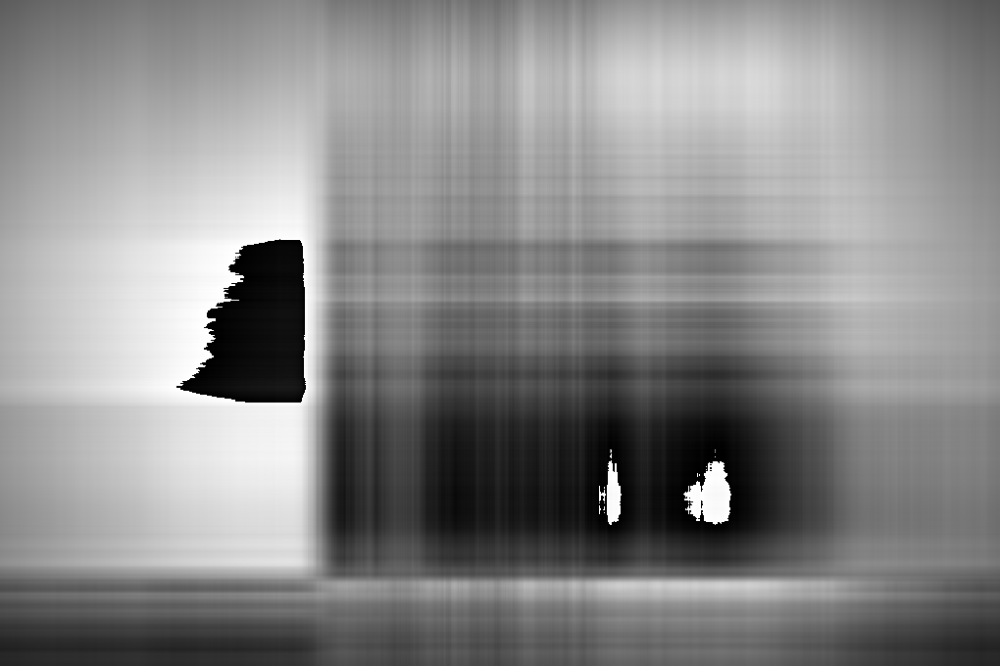
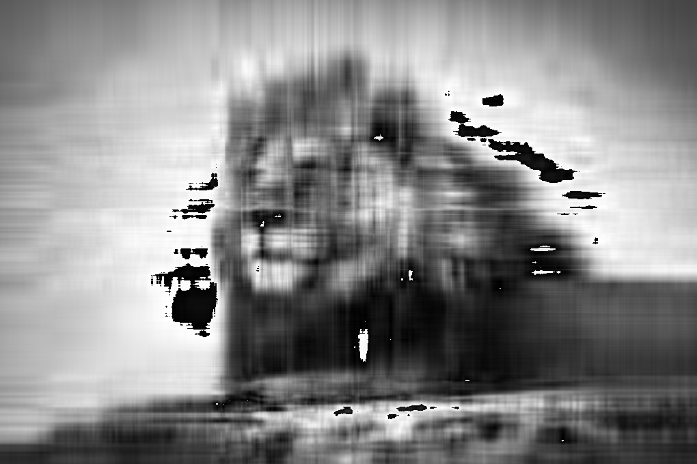
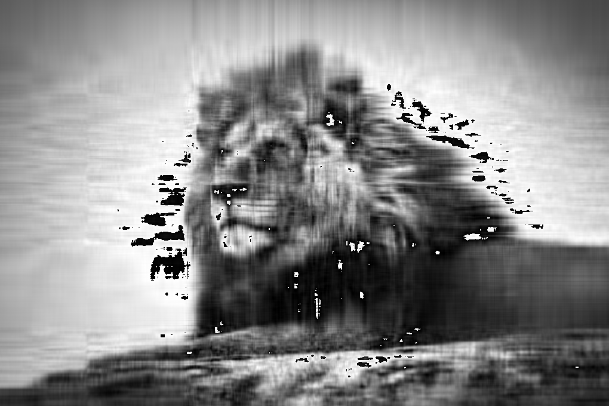
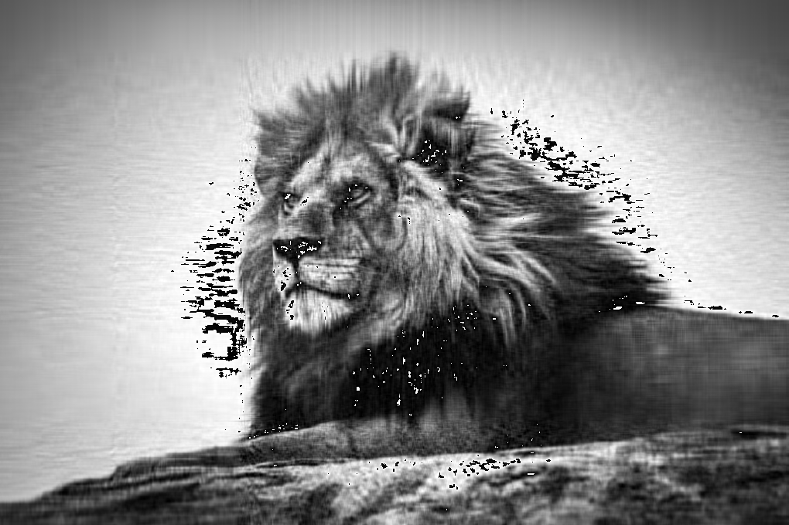

# Compresser

This program takes in an image and compresses it in the same extension. Using Single Value Decomposition(SVD) and the Gram-Schmidt Algorithm, this program is able to reduce the final size in a few seconds.

#### Inputs

The inputs to this program are a `file directory` (absolute or relative path), and a `decomposition percentage`(DP) which is basically how high you want the resolution to be.

#### Samples

| DP  |          Image          |
| :-: | :---------------------: |
|  1  |    |
| 10  |   |
| 20  |   |
| 50  |   |
| 100 |  |
| 200 |  |
| 400 |  |
