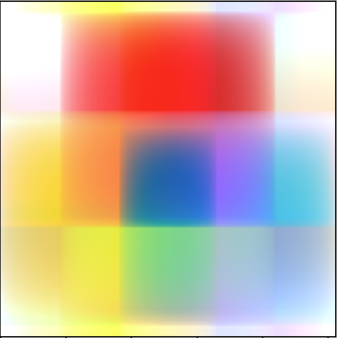
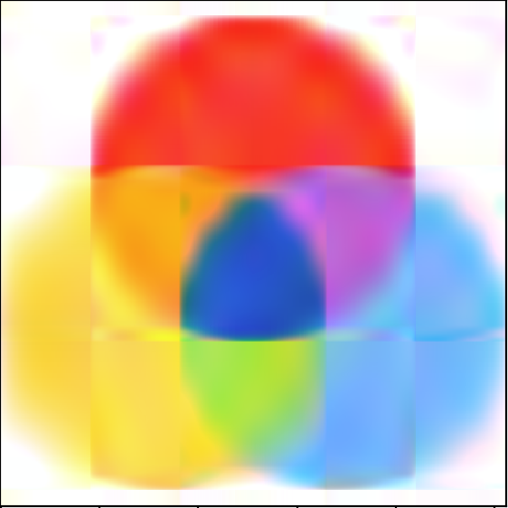
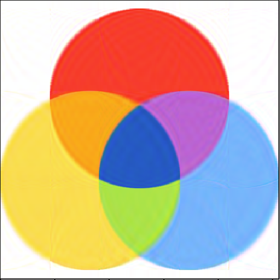
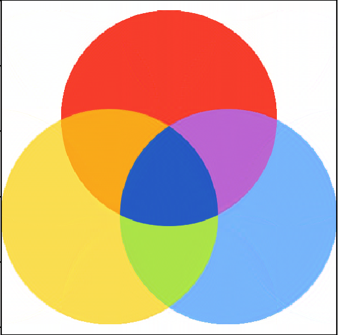
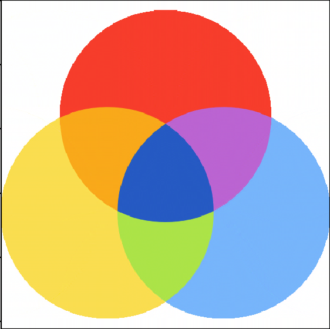

# LinearPress

This program takes in an image and compresses it in the same extension. Using Single Value Decomposition(SVD) and the Gram-Schmidt Algorithm, this program is able to reduce the image size in a few seconds.

#### Inputs

The inputs to this program are a `file directory` (absolute or relative path), and a `resolution percentage`(RP) which is basically how high you want the resolution to be.

### Sample output

These are sample outputs of an RGB image for various `resolution percentage's`.

{: style="float: left"}

| Resolution Percentage | Eigenvalues |                        Image                        |
| :-------------------: | :---------: | :-------------------------------------------------: |
|      0.1953125%       |      1      |    |
|      0.9765625%       |      5      |    |
|       1.953125%       |     10      |   |
|      4.8828125%       |     25      |   |
|       9.765625%       |     50      |   |
|       19.53125%       |     100     |  |
|       39.0625%        |     200     |  |
|         100%          |     512     |  |
